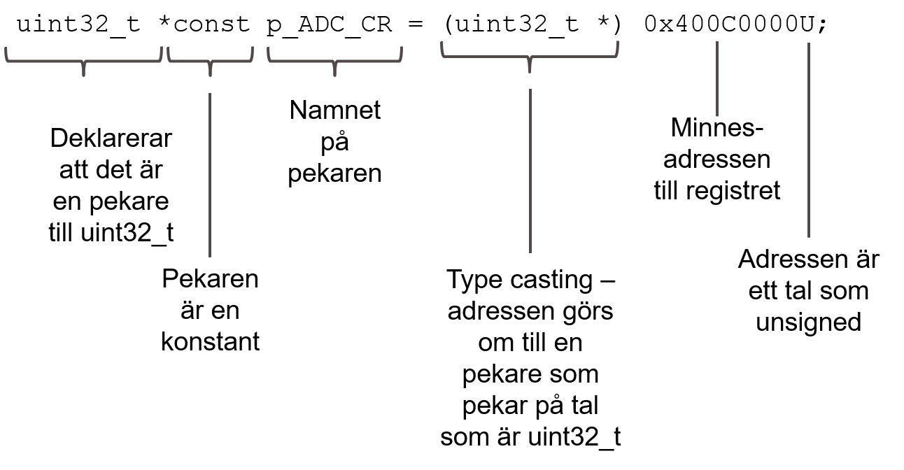

# Key elements in C you need to know

This is not a book on C programmming, and this chapter is just  short refresher of some basic concepts that you  need to know, if you feel unsure about C get a good textbook. The classic text on C is Kernighan and Ritchie's "C Programming Language" from 1988, however you might prefer a more modern book such as B. Klemens' "21st Century C" from 2014 or K. N. King's "C Programming: A Modern Approach" from 2008. If you just want a refresher you can download [Essential C](http://cslibrary.stanford.edu/101/), which is a 45-page summary of the C language by Nick Parlante.

## Definition versus declaration
There might be some confusion of these two terms (even if they are defined in K&R p. 170), but I have tried to use the following conventions as consistently as possible in the rest of the text.

_Definition_ is the (only) place where a variable is created or space is reserved in the memory.
A function definition or prototype contains the code of what should be executed when it is called.
_Declaration_ means those places in the program files where the type of a variable or function is described so it can be used correctly by the compiler, but no space is reserved in memory for it. A function declaration allows the compiler to evaluate if the function is used correctly with the correct argument types.

T> You _define_ a variable in an c-file, not in an h-file. It is possible to do it in an h-file, and you probably would not even get a warning, but avoid it.

T> You _declare_ a function in an h-file with the same name as the c-file where it is defined. Then it becomes easy to understand which h-file to be included to use a certain function.

You can declare functions in the c-file using them (making updates hard to do) and you can share a joint h-file for multiple c-files, but avoid these practices.

## Types and type definitions

The most commonly used variable type in embedded C is the integer, which is used both for variables in processors with no floating point unit, and for handling single bits by bit-masking. Unfortunately `int` does not have a fixed size in C.

Luckily there is an easy way to handle this since _C99_ introduced a library with [fixed size variable types](https://en.wikipedia.org/wiki/C_data_types#Fixed-width_integer_types):

```c
#include <inttypes.h>
```
`<inttypes.h>` gives you control of a variable with exact bit lengths, some examples:

```c
uint32_t LongVariable;
uint8_t ByteVariable; /* 0..255 */
int16_t SignedVariable /*−32,768..32,767 */
```

If `<inttypes.h>` is not available a simple tactic is to do your own type definitions. 
The following is from the MISRA-C 2004 Guidelines, rule 6.3:

```c
typedef char            char_t;
typedef signed char     int8_t;
typedef signed short    int16_t;
typedef signed int      int32_t;
typedef signed long     int64_t;
typedef unsigned char   uint8_t;
typedef unsigned short  uint16_t;
typedef unsigned int    uint32_t;
typedef unsigned long   uint64_t;
typedef float           float32_t;
typedef double          float64_t;
typedef long double     float128_t
```
You can even make your own `inttypes.h` similar to the code snippet above and make sure that is used in every source code file:

```c
#include "inttypes.h"
```
But beware that the exact implementation of `char`, `int`, `long` and `float` depends on your compiler, read the documentation!

T> So when should you use signed or unsigned integers? A simple suggestion is:
T> For all cases when you need to manipulate singel bits or shift things right or left _always_ use unsigned
T> For all other cases use signed integers, even if you never expect the value to be below 0. There will not be a runtime check that the value is positive before assigning it to the variable anyway, and this way it will be even harder to debug.

## Masking

Masking is when I want to single out a single bit, e.g. to know the value of a single bit in e.g. `uint16_t statusRegister;`

There are several ways to say bit 8 is set to 1

```c
0b00000000100000000
0x0100U
(1 << (8))
```

_Note! The rightmost bit is bit 0! Not bit 1!_

The following code executes the the if-statement when bit 8 is set in `statusRegister` by using the bitwise comparison operator in C (remember that any value not zero is handled as true in C):

```c
if (statusRegister & 0x0100) 
{
	/* code to be executed */
}
```
False if bit 8 in `statusRegister` is 0  
True if bit 8 is 1.  
But what if you want to check if exactly the wanted bits are set?

```c
if (statusRegister & 0x0102)
{
	/* True if bit 8 and bit 1 is 1 */
	/* True if bit 8 is 1 and bit 1 is 0 */
	/* True if bit 8 is 0 and bit 1 is 1 */
}
```
The above is obviously not correct! The following will however behave as expected.

```c
if ((statusRegister & 0x0102) == 0x0102)
{
	/* Do something */
}
```

If you want to set the value of a single bit in an I/O-register `uint16_t controlRegister;`, you can use masking to set single bits

```c
controlRegister = controlRegister | 0x0040;
```
forces bit 6 to 1, all other bits keep their values by using the bitwise or-operator in C. Of course I can accomplish the same by using C-shorthand:

```c
controlRegister |= 0x0040;
``` 
_Note that this is sneaky since you can be led to believe that you acutally set the register with a single assembly instruction, but most processors will use several instrucitons to accomplish this._ We will talk more about this in the chapter in on interrupts.


## Specifiers

C does not have many protections against mistakes, so why not using the few of them there are? These specifiers are of great use to an embedded programmer, and a firm grasp of how to use them helps a lot.

- `static`
- `volatile`
- `const`, and 
- `extern`

### Static
Static has three uses in C:

- A variable that is defined as static inside a funktion retains it value between the case of a function.  
  _insert example code_

- A variable that is defined as static in a module (i.e. a c-file), but outside of a function can be used by all functions within that module. But it cannot be used by functions in other modules. It is in practice a localised global variable.  
  _insert example code_

- A functions that is defined as static can only be called by other functions within that module, it hides the function from the world.  
  _insert example code_

These three uses makes more sense if you think of `static` as an instruction to the complier to not use the stack for these variables, and instead use a permanent (or static) address in RAM. Then it makes sense that you can keep e.g. variable values between funciton calls.

### Volatile


### const
`const`is actually not a constant in C, unlike some other languages.


The typical declaration is

```c
const uint32_t StatusRegister;
```

this is equivalent to

```c
uint32_t const StatusRegister;
```
both are treated the same by the compiler.

This definition tells the compiler that you are not allowed to change `StatusRegister` in your code, e.g. you cannot assign `StatusRegister` a new value without getting a compiler error. It does not mean that the variable cannot change by other means, so it is not a true constant, e.g. in the case of a status register the variable could change depending on the status of the hardware device.

From a memory perspective it is easy to think of the difference between a true constant, which would reside in the flash memory of the MCU, while a `const` variable will have a reserved memory area in the RAM, however the program, and programmer, is not allowed to modify that memory area.

I cannot think of any situation where you would _need_ to use `const` to get your C-program to do what you want, but is good practice to use `const` anyway.

The `const` qualifier is of special interest when it comes to declaring pointers, since it can prohibit you making some mistakes later on when using them. A common situation is when you want the pointer to always point at the same memory adress:

```c
uint32_t ADC_CR;
uint32_t * const p_ADC_CR = &ADC_CR;
```

this is interpreted as `p_ADC_CR` is constant, and is pointing to a 32-bit integer. In this case the pointer `p_ADC_CR` can never point to any other memory address than where the variable `ADC_CR` is located.

The opposite use is also possible; when the variable the pointer is pointing at should not be changed by the code, but the pointer can be changed to point to something else

```c
uint32_t ADC_SR;
uint32_t const *p_SR = &ADC_SR;
```

Here the status register `ADC_SR` cannot be changed by dereferencing the pointer `p_SR`, but it is perfectly possible to let `p_SR` point to another status register instead of the A/D-converter.

To summarise; `const` is not necessary, but it can prevent some silly mistakes, it allows the compiler to optimise stuff correctly, and it informs people reading the code about how a variable should be used.

### Extern

A variable that is _declared_ as extern in a module (c-file) is _defined_ in another module. The memory space is reserved when the compiler goes through the other module, but the compiler knows the type even though it does not reserve any memory space.
You can therefore use the same variable name in multiple files and make them all adress the same memory space, this is being resolved by the linker.


## Function basics
The following is a classic example used to understand how function parameters work in C:

```c
void swap(int x, int y)
/* Function that swaps the values of two variables
 * Example from K&R 2nd ed. */
{
    int temp;
    temp = x;
    x = y;
    y = temp;
}
```

Unfortunately this does not work!

There are two principles for passing arguments to functions and typically programming language uses one or the other:

- ”Call by value”
- ”Call by reference”

C uses ”call by value”; every time a function is called it gets a copy with the value of the inparameters which are used internally. So when the function has finished executing the inparamaters have the same value in the calling program as before the function was called.

C gets around this by using what is called pointers.

## Pointers and pointer arithmetic

Pointers are a key element in C, but this book will not be a full course on pointers, read one of the texts above, or look at the short intro [Pointers and Memory](http://cslibrary.stanford.edu/102/) by Nick Parlante.

In C I can change the value of the pointee without changing the value of the pointer. This is the solution to the swap function above. You send the memory addresses of the variables as the function parameters instead. The address where the variable resides in the memory map is the same regardless of the value of the variable!

```c
swap(&a, &b);
```

The operator `&` gives the adress of  variable `a`, so  `&a` is a pointer to `a`. This makes it possible to change parameters sent to a function and use the changed value after the completion of the function.


The most common mistake in using pointers is not assigning memory space where it points

```c
int main(void)
{
    int *p_int;

    p_int* = 43
    /* Horrible crash */
}
```

The code above may work, or not, but in most cases you will not know until you run the program. The program may even work in some cases, it all depends on if the variable `p_int` has a value that points to an unused memory address in the RAM. If it doesn't, you will either change an unknown place in the RAM memory or try to change some other hardware, which may or may not allow write access.

### Pointers to control hardware

Declaration of the pointer
```c
uint32_t *const p_ADC_CR = (uint32_t *) 0x400C0000U;
```


Start the analog-to-digital conversion in the program

```c
#define STARTADC 0x0002U /* bit 1 starts ADC */
*p_ADC_CR = STARTADC;
```

With a nice `#define`

```c
#define ADC_CR (*p_ADC_CR)
```
It is possible to write
```
ADC_CR = STARTADC;
```

